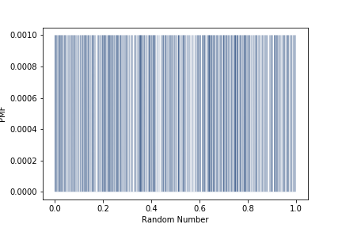
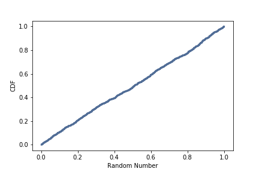

[Think Stats Chapter 4 Exercise 2](http://greenteapress.com/thinkstats2/html/thinkstats2005.html#toc41) (a random distribution)  

The numbers generated by random.random are supposed to be uniform between 0 and 1; that is, every value in the range should have the same probability.  

Generate 1000 numbers from random.random and plot their PMF and CDF.  

Is the distribution uniform?

>> ```python
>> import numpy as np
>> import thinkstats2
>> import thinkplot
>> ```
>>
>> Generate array of random numbers
>> ```python
>> nums = np.random.random(1000)
>> ```
>>
>> Plot PMF
>> ```python
>> pmf = thinkstats2.Pmf(nums)
>> thinkplot.Pmf(pmf, linewidth=0.1)
>> thinkplot.Config(xlabel='Random Number', ylabel='PMF')
>> ```
>> 
>>
>> Plot CDF
>> ```python
>> cdf = thinkstats2.Cdf(nums)
>> thinkplot.Cdf(cdf)
>> thinkplot.Config(xlabel='Random Number', ylabel='CDF')
>> ```
>> 
>>
>> The distribution is uniform.
