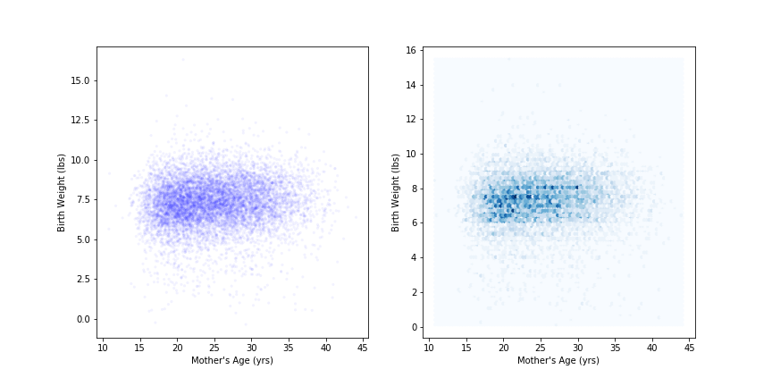
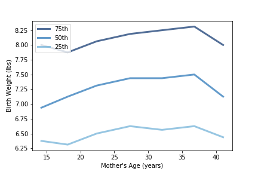

[Think Stats Chapter 7 Exercise 1](http://greenteapress.com/thinkstats2/html/thinkstats2008.html#toc70) (weight vs. age)  

Using data from the NSFG, make a scatter plot of birth weight versus mother’s age. Plot percentiles of birth weight versus mother’s age. Compute Pearson’s and Spearman’s correlations. How would you characterize the relationship between these variables?

>> Load Data and Import Modules
>> ```python
>> import first
>> import numpy as np
>> import pandas as pd
>>
>> live, firsts, others = first.MakeFrames()
>> live = live.dropna(subset=['agepreg', 'totalwgt_lb'])
>> ```
>>
>> Plot Mother's Age vs. Birth Weight
>> ```python
>> # Extract birth weight and mother's age
>> wt, age = live.totalwgt_lb, live.agepreg
>>
>> # ScatterPlot
>> thinkplot.PrePlot(2, cols=2)
>> thinkplot.Scatter(age, Jitter(wt, 0.5), alpha=0.05, s=10)
>> thinkplot.Config(xlabel="Mother's Age (yrs)",
>>                  ylabel='Birth Weight (lbs)',
>>                  legend=False)
>>
>> # HexPlot
>> thinkplot.PrePlot(2)
>> thinkplot.SubPlot(2)
>> thinkplot.HexBin(age, wt)
>> thinkplot.Config(xlabel="Mother's Age (yrs)",
>>                  ylabel='Birth Weight (lbs)',
>>                  legend=False)
>> ```
>> 
>>
>> Plot Mother's Age vs. Birth Weight Quartiles
>> ```python
>> # bin data by mother's age
>> bins = np.arange(10, 50, 5)
>> indices = np.digitize(live.agepreg, bins)
>> groups = live.groupby(indices)
>>
>> # compute mean age and cdf for each group
>> mean_age = [group.agepreg.mean() for i, group in groups]
>> cdfs = [thinkstats2.Cdf(group.totalwgt_lb) for i, group in groups]
>>
>> # compute and plot quartiles for each group
>> thinkplot.PrePlot(3)
>> for percent in [75, 50, 25]:
>>     wt_percentiles = [cdf.Percentile(percent) for cdf in cdfs]
>>     label = '%dth' % percent
>>     thinkplot.Plot(mean_age, wt_percentiles, label=label)
>>        
>> thinkplot.Config(xlabel="Mother's Age (years)",
>>                  ylabel='Birth Weight (lbs)', 
>>                  legend=True)
>> ```
>> 
>>
>> Define Correlation Functions
>> ```python
>> # Covariance
>> def Cov(xs, ys, meanx=None, meany=None):
>>     '''Calculates the covariance of x and y'''
>>     xs = np.asarray(xs)
>>     if meanx is None:
>>         meanx = np.mean(xs)
>>
>>     ys = np.asarray(ys)
>>     if meany is None:
>>         meany = np.mean(ys)
>>
>>     cov = np.dot(xs-meanx, ys-meany) / len(xs)
>>     return cov
>> 
>> # Pearson Correlation
>> def Corr(xs, ys):
>>     '''Calculates the Pearson correlation coefficient of x and y'''
>>     xs = np.asarray(xs)
>>     meanx, varx = thinkstats2.MeanVar(xs)
>>
>>     ys = np.asarray(ys)
>>     meany, vary = thinkstats2.MeanVar(ys)
>> 
>>     corr = Cov(xs, ys, meanx, meany) / np.sqrt(varx * vary)
>>     return corr
>>
>> # Spearman
>> def SpearmanCorr(xs, ys):
>>     '''Calculates the Spearman correlation coefficient of x and y'''
>>     xranks = pd.Series(xs).rank()
>>     yranks = pd.Series(ys).rank()
>>
>>     return Corr(xranks, yranks)
>> ```
>>
>> Compute Pearson and Spearman Correlation Coefficients
>> ```python
>> print('Pearson:', Corr(age, wt))
>> print('Spearman', SpearmanCorr(age, wt))
>> ```
>> Pearson: 0.0688339703541  
>> Spearman: 0.0946100410966
>>
>> There is minimal correlation between the mother's age and the baby's birth weight.
