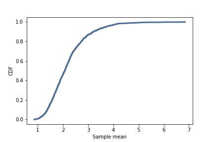
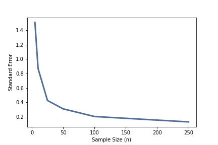

[Think Stats Chapter 8 Exercise 2](http://greenteapress.com/thinkstats2/html/thinkstats2009.html#toc77) (scoring)  

Suppose you draw a sample with size n=10 from an exponential distribution with λ=2. Simulate this experiment 1000 times and plot the sampling distribution of the estimate L. Compute the standard error of the estimate and the 90% confidence interval.
Repeat the experiment with a few different values of n and make a plot of standard error versus n.  

>> Simulate random exponential distribution sampling experiment.
>> ```python
>> def SimulateExperiment(lam=2, n=10, iters=1000):
>>     lam_estimates = []
>>     for ii in range(iters):
>>         xs = np.random.exponential(1 / lam, n)
>>         L = 1 / np.mean(xs)
>>         lam_estimates.append(L)
>>     return lam_estimates
>>
>> estimates = SimulateExperiment()
>> ```
>> 
>> Plot the sampling disribution of the estimate.
>> ```python
>> # Compute CDF
>> cdf = thinkstats2.Cdf(estimates)
>>
>> # Plot CDF
>> thinkplot.Cdf(cdf)
>> thinkplot.Config(xlabel='Sample mean',
>>                  ylabel='CDF')
>> ```
>>
>> 
>>
>> Calculate 90% confidence interval and standard error
>> ```python
>> # Calculate confidence interval
>> ci = cdf.Percentile(5), cdf.Percentile(95)
>> print('90% Confidence Interval:', ci)
>> 
>> # Calculate standard error
>> stderr = RMSE(estimates, 2)
>> print('Standard Error:', stderr)
>> ```
>> 90% Confidence Interval: (1.3137289539246408, 3.7058576636232319)  
>> Standard Error: 0.830910745221
>>
>> Simulate random sampling experiment with different sample sizes (n=5, 10, 25, 50, 100, 250):
>> ```python
>> lam = 2
>> ns = [5, 10, 25, 50, 100, 250]
>> iters = 1000
>>
>> stderr = []
>> for n in ns:
>>     estimates = SimulateExperiment(lam=lam, n=n, iters=iters)
>>     stderr.append(RMSE(estimates, lam))
>> ```
>>
>> Plot Sample Size vs. Standard Error:
>> ```python
>> thinkplot.plot(ns, stderr)
>> thinkplot.Config(xlabel='Sample Size (n)',
>>                  ylabel='Standard Error')
>> ```
>>
>> 
>>
