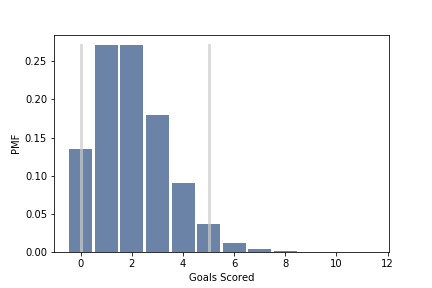

[Think Stats Chapter 8 Exercise 3](http://greenteapress.com/thinkstats2/html/thinkstats2009.html#toc77)

In games like hockey and soccer, the time between goals is roughly exponential. So you could estimate a team’s goal-scoring rate by observing the number of goals they score in a game. This estimation process is a little different from sampling the time between goals, so let’s see how it works.

Write a function that takes a goal-scoring rate, lam, in goals per game, and simulates a game by generating the time between goals until the total time exceeds 1 game, then returns the number of goals scored.

Write another function that simulates many games, stores the estimates of lam, then computes their mean error and RMSE.

Is this way of making an estimate biased? Plot the sampling distribution of the estimates and the 90% confidence interval. What is the standard error? What happens to sampling error for increasing values of lam?

>> Single Game Simulation
>> ```python
>> def SimulateGame(lam):
>>     """
>>     Simulates a game and returns the estimated goal-scoring rate.
>>     lam: actual goal scoring rate in goals per game
>>     """
>>     goals = 0
>>     t = 0
>>     while True:
>>         time_between_goals = random.expovariate(lam)
>>         t += time_between_goals
>>         if t > 1:
>>             break
>>         goals += 1
>> 
>>     # estimated goal-scoring rate is the actual number of goals scored
>>     L = goals
>>     return L
>> ```
>>
>> Many Game Simulation
>> ```python
>> def SimulateManyGames(lam=2, n=1000):
>>     """
>>     Simulates many games and returns the RMSE and the mean error.
>>     lam: actual goal scoring rate in goals per game
>>     n:   number of games to simulate
>>     """
>>     goals_est = []
>>     for game in range(n):
>>         goals_est.append(SimulateGame(lam))
>>      
>>     return (goals_est, RMSE(goals_est, lam), MeanError(goals_est, lam))
>> ```
>>
>> Is this way of making an estimate biased?
>> ```python
>> lam = 2
>> num_games = [10, 100, 1000, 10**4, 10**5, 10**6, 10**7]
>> for n in num_games:
>>     print('n={}:'.format(n), SimulateManyGames(lam=lam, n=n)[1:])  
>> ```
>> n=10: (1.5811388300841898, -0.10000000000000001)  
>> n=100: (1.3928388277184118, 0.080000000000000002)  
>> n=1000: (1.451895313030523, -0.0060000000000000001)  
>> n=10000: (1.4058093754133238, 0.0051000000000000004)  
>> n=100000: (1.4160861555710513, 0.010019999999999999)  
>> n=1000000: (1.4169957656958612, 0.0036389999999999999)  
>> n=10000000: (1.4142708368625863, -0.00096060000000000004)  
>>
>> The mean error is small and decreases with n; therefore, this estimator appears to be unbiased.
>>
>> Plot Goals Distribution
>> ```python
>> estimates, rmse, me = SimulateManyGames() 
>> pmf = thinkstats2.Pmf(estimates)
>> thinkplot.Hist(pmf)
>> thinkplot.Config(xlabel='Goals Scored', ylabel='PMF')
>> ```
>>
>> 
>>
>> Calculate Standard Error
>> ```python
>> print('RMSE:', rmse)
>> ```
>> RMSE: 1.41337999137  
>>
>> What happens to sampling error for increasing values of lam?
>> ```python
>> n = 10**6
>> L = range(1, 11)
>> for lam in L:
>>     print('L={}:'.format(lam), SimulateManyGames(lam=lam, n=n)[1:])
>> ```
>> L=1: (0.99988649355814385, 0.00042499999999999998)  
>> L=2: (1.4150183744390035, 0.0015410000000000001)  
>> L=3: (1.7327795589745396, 0.003277)  
>> L=4: (1.9975432410839071, 0.00026899999999999998)  
>> L=5: (2.2365068745702525, -0.000919)  
>> L=6: (2.4500599992653243, -0.0045659999999999997)  
>> L=7: (2.6491287246942155, 0.0063870000000000003)  
>> L=8: (2.8301969896104402, -0.0022950000000000002)  
>> L=9: (2.9986300205260403, 0.0023340000000000001)  
>> L=10: (3.1642141204412826, 0.002287)  
>>
>> As lambda increases, RMSE increases.
